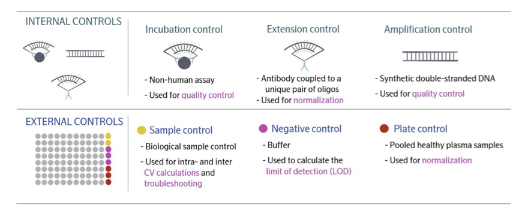
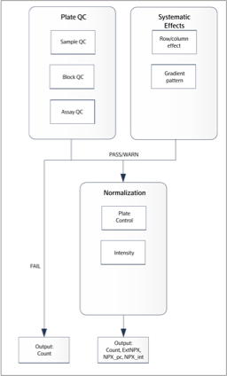
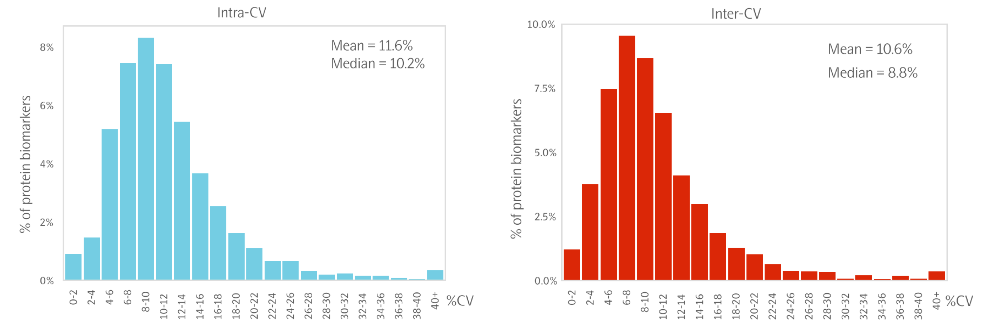

# Olink Pilot Study: Analysis Tutorial
Wei Zhu
2025-12-17

- [Introduction](#introduction)
  - [1. Platform Overview: Olink Explore
    HT](#1-platform-overview-olink-explore-ht)
    - [Key Features](#key-features)
  - [2. Core Terminology & Data
    Structure](#2-core-terminology--data-structure)
  - [3. Control Systems & Quality Control
    (QC)](#3-control-systems--quality-control-qc)
    - [Internal and external controls](#internal-and-external-controls)
    - [The QC workflow](#the-qc-workflow)
    - [QC Flags](#qc-flags)
  - [4. Platform Reliability: The “CV
    Gap”](#4-platform-reliability-the-cv-gap)
    - [Olink Internal Validation](#olink-internal-validation)
    - [Third-Party Findings (Rooney et al.,
      2025)](#third-party-findings-rooney-et-al-2025)
  - [5. Handling the Limit of Detection
    (LOD)](#5-handling-the-limit-of-detection-lod)
    - [LOD and Data Quality](#lod-and-data-quality)
    - [Best Practices](#best-practices)
  - [6. Data Cleaning Protocol
    (“all_fix”)](#6-data-cleaning-protocol-all_fix)

------------------------------------------------------------------------

## Introduction

### 1. Platform Overview: Olink Explore HT

Olink High-Throughput (HT) proteomic platform that combines the
specificity of **Proximity Extension Assay (PEA)** with
**Next-Generation Sequencing (NGS)** readout.

#### Key Features

- **Multiplexing**: Simultaneously measures **5,420 protein biomarkers**
  organized into **8 blocks**
  [ExploreHT_Validation.pdf](./data/ExploreHT_Validation.pdf).
- **Dynamic Range**: Achieves a 10-log dynamic range by utilizing
  different sample dilutions within the blocks.
- **Sample Efficiency**: Requires only **2 µL** of sample for the entire
  panel.

------------------------------------------------------------------------

### 2. Core Terminology & Data Structure

- **Projects**: The primary unit of organization in the analysis
  software, containing metadata and run results
  [NPX_Manual.pdf](./data/NPX_Manual.pdf).
- **Plates**: Standard 96-well format used for processing.
- **Assays**: The individual antibody-based tests for specific protein
  targets.
- **Normalization**: The conversion of raw NGS counts into **NPX
  (Normalized Protein Expression)**, a relative $log_2$ scale.

------------------------------------------------------------------------

### 3. Control Systems & Quality Control (QC)

The platform relies on a sophisticated hierarchy of controls to ensure
data quality [ExploreHT_QC.pdf](./data/ExploreHT_QC.pdf).

#### Internal and external controls

<div id="fig-olink-controls">



Figure 1: Internal and external controls

</div>

#### The QC workflow

<div id="fig-qc-workflow">



Figure 2: Olink QC workflow

</div>

#### QC Flags

- **Sample QC**: Triggered if internal controls deviate \>0.3 NPX from
  the median.
- **Assay QC**: Triggered if external controls for a specific protein
  deviate beyond acceptable limits on a given plate.

------------------------------------------------------------------------

### 4. Platform Reliability: The “CV Gap”

There is a documented discrepancy between manufacturer-reported
reliability and independent study results.

#### Olink Internal Validation

Official metrics report high precision
[ExploreHT_Validation.pdf](./data/ExploreHT_Validation.pdf): \*
**IntraCV (Within-plate)**: Median ~11.2%. \* **InterCV
(Between-plates)**: Median ~8.7%.

- Distribution of intra-and inter CVs



<p align="center">


</p>

- [CIMAC_Validation.pdf](./data/CIMAC_Validation.pdf) 124 plasma samples
  (from 115 cancer patients, 5 individual health donor, 1 pooled plasma
  from healthy donors) were assayed using Olink Explore HT. The CV for
  each block was assessed by NPX values of ***selected (5%)*** of the
  analytes among replicates of sample controls, per Olink protocol.

| Block | \# of assays | Dilution factor | Intra-assay %CV mean | Inter-assay %CV mean |
|:-----:|:------------:|:---------------:|:--------------------:|:--------------------:|
|   1   |     742      |       1:1       |         23.3         |         20.7         |
|   2   |     1314     |       1:1       |         13.3         |         11.8         |
|   3   |     1204     |       1:1       |         9.8          |         7.1          |
|   4   |     1106     |       1:1       |         7.2          |         3.5          |
|   5   |     582      |      1:10       |         6.6          |         3.8          |
|   6   |     270      |      1:100      |         5.6          |         5.3          |
|   7   |     134      |     1:1000      |         11.0         |         6.2          |
|   8   |      68      |    1:100,000    |         8.6          |         12.4         |

#### Third-Party Findings (Rooney et al., 2025)

- Independent evaluation using the ARIC cohort (102 split samples)
  reported lower precision
  [Rooney2025_ARIC.pdf](./data/Rooney2025_ARIC.pdf):
- **Median CV**: **35.7%** for the Explore HT panel.
- **Comparison**: This variation is higher than the older Explore 3072
  panel (19.8% CV) in the same study.
- **Conclusion**: High variation is often driven by the large number of
  assays residing near the technical noise floor in clinical samples.

------------------------------------------------------------------------

### 5. Handling the Limit of Detection (LOD)

The LOD is the threshold where the protein signal is statistically
distinguishable from the Negative Control background.

#### LOD and Data Quality

Reliability is strongly tied to the signal-to-noise ratio
[Rooney2025_ARIC.pdf](./data/Rooney2025_ARIC.pdf): \* Precision is
inversely correlated with the percentage of samples above LOD
($r = -0.77$). \* Assays where $NPX < LOD$ are dominated by technical
noise, leadin to artificially inflated CVs.

#### Best Practices

1.  **Filtering for Validation**: When calculating IntraCV or InterCV,
    **exclude** data points where $NPX < LOD$.
2.  **Imputation for Analysis**: For biological discovery, Olink
    recommends original NPX. However, some researchers replace values
    below LOD with $LOD/2$ to stabilize correlation analysis.
3.  **Reporting**: Always report the “Percent Above LOD” for every assay
    as a primary quality metric.

------------------------------------------------------------------------

### 6. Data Cleaning Protocol (“all_fix”)

Based on the pilot study, we recommend the following workflow: 1. **Flag
LOD**: Identify $NPX < LOD$ values. 2. **Missingness**: Drop assays if
\>50% of values are `NA` on a plate or across the study. 3. **Sample
Filtering**: Drop samples with \>300 missing values. 4.
**Normalization**: Use **Intensity Normalization** (or subset
normalization) to align projects with similar biological distributions.

``` code-annotation-code


```r
library(tidyverse)
library(palmerpenguins)
penguins |>
  mutate(
    bill_ratio = bill_depth_mm / bill_length_mm,
    bill_area  = bill_depth_mm * bill_length_mm
  )
```

Line 6  
Take `penguins`, and then,

Lines 7-10  
add new columns for the bill ratio and bill area.
